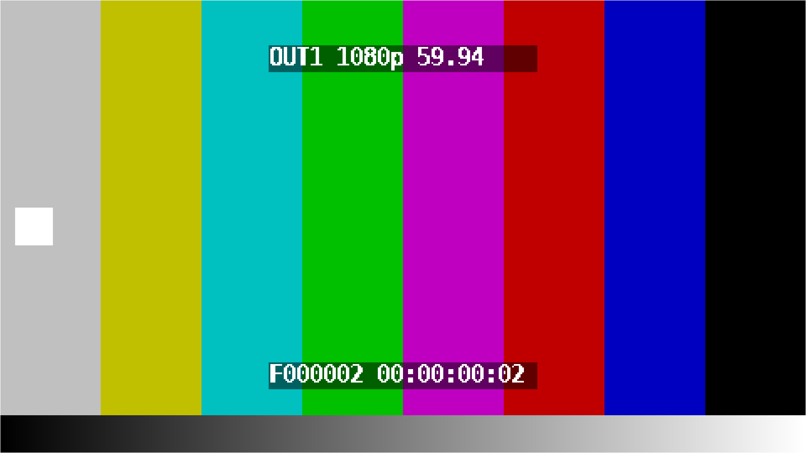
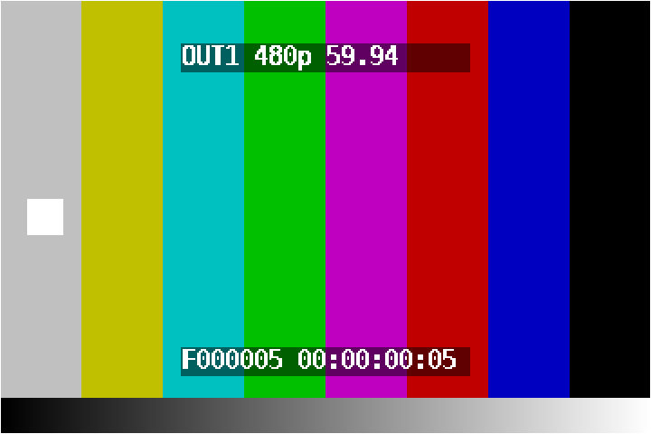

# esp32-hdmi-quad-splitter

Full HD のテスト映像を **1 台のデバイス内で生成し、HDMI 4 本に出力する**装置の設計。

> リポジトリ名は初期案(ESP32 + 分配器)に由来します。現在の方針は **FPGA によるテストパターン発生器**です。
> mp4 の再生は行わず、カラーバー・フレームカウンタ・タイムコードをロジックで生成して 4 本を独立したタイミングで出します。

## 現在の方針: FPGA 4 出力テストパターン発生器

| 項目 | 内容 |
|---|---|
| FPGA | Xilinx Artix-7 XC7A35T 以上(無償 Vivado、MMCM ×4 で 6 種のピクセルクロックを 1 ppm 以内で生成) |
| HDMI 送信 | ADI ADV7513 ×4(24bit RGB パラレル入力 → HDMI 1.4、1080p60 対応、資料公開) |
| 出力 | 1080p / 720p / 480p × 29.97p / 59.94p / 30p / 60p を出力ごとに独立して設定 |
| 画面 | 75% カラーバー、動くボックス(コマ落ち検出)、グレースケール、外枠、ラベル、6 桁フレームカウンタ、タイムコード |
| 状態 | HDL 一式と iverilog シミュレーション済み。実機基板は未作成 |

```
100 MHz --> [Artix-7: MMCM x4 -> timing -> pattern] --24bit RGB--> [ADV7513] --> HDMI OUT1
                                   |                              [ADV7513] --> HDMI OUT2
                                   |                              [ADV7513] --> HDMI OUT3
                                   +---------- I2C 初期化 ------->[ADV7513] --> HDMI OUT4
```

シミュレーション結果(1080p 59.94 / 480p 59.94):





詳細は [docs/fpga-pattern-generator.md](docs/fpga-pattern-generator.md)。

### 試す

```
cd sim && make MODE=1 FRAME=2     # iverilog で 1080p59.94 の 1 フレームを frame.ppm に保存
```

### ディレクトリ

| パス | 内容 |
|---|---|
| hdl/ | Verilog ソース(タイミング、パターン、文字重畳、MMCM、ADV7513 初期化、トップ) |
| sim/ | iverilog テストベンチと Makefile |
| constraints/ | Vivado 制約ファイルの例 |
| tools/make-font.py | フォント ROM 生成 |
| docs/ | 設計文書 |

## 検討経緯

| 案 | 判定 | 理由 |
|---|---|---|
| ESP32 + LT86104SX 分配器 | 不採用 | ESP32 は映像を生成できない。分配器は同一映像しか出せない |
| RK3588 で mp4 を再生し 4 CRTC へ | 代替案 | 自己完結するが、Linux と SoM が要り、出力ごとの独立タイミングは難しい。[docs/self-contained.md](docs/self-contained.md) |
| Ambarella A7 | 不採用 | HDMI 1 本、SDK は NDA |
| **FPGA パターン発生器** | **採用** | テストパターンで十分。出力ごとに独立したクロックを持て、BOM が小さい |

---

## 初期案(参考): ESP32 + LT86104SX 分配器

以下は「外部 HDMI ソース + 分配器を ESP32 で制御する」初期案の記録です。同一映像の 4 分配だけが目的ならこの構成でも成立します。

### 結論: 実現可能(ただし ESP32 は「制御担当」)

| 役割 | 担当 | 備考 |
|---|---|---|
| Full HD 映像の生成 | PC(ffmpeg) | [docs/video-source.md](docs/video-source.md) |
| Full HD 映像の再生(HDMI ソース) | **Raspberry Pi 4/5 など**(mpv) | ESP32 単体では不可 |
| 1→4 分配、HDCP リピータ、EDID 処理 | LT86104SX | 1080p60 まで、3.4 Gbps/ch |
| IC の初期化・EDID 管理・入力監視・出力 ON/OFF | ESP32(I2C マスタ) | Wi-Fi 経由でリモート制御も可 |

- LT86104SX は入力 HDMI 信号をそのまま 4 系統へ複製する IC で、映像の生成や解像度変換は行いません。
- ESP32(無印 / S3 / C3)には TMDS 出力が無く、1080p60(約 4.5 Gbps)の映像を生成する帯域も持たないため、**映像ソースにはなれません**。
- したがって「ESP32 + LT86104SX」で成立するのは **`HDMI ソース → LT86104SX → HDMI×4` を ESP32 が I2C で制御する構成** です。同じ映像を 4 台のモニタに出す用途なら、これで十分です。

### 4 本が「別々の映像」である必要がある場合

スプリッタでは実現できません。RK3588(4 画面同時出力)や 4 出力 GPU(ASUS GT710-4H など)を使ってください。

### ESP32-P4 を映像ソースにできるか

ESP32-P4 は MIPI-DSI(2 レーン)と H.264 デコーダを持つため、`ESP32-P4 → LT9611 / LT8912B (DSI→HDMI) → LT86104SX` で **1080p30 程度のテストパターン/静止画** を出すことは原理的に可能です。ただし 1080p60(RGB888 で約 3.56 Gbps)は DSI 帯域を超えるため、59.94p / 60p のテストは不可です。本リポジトリでは扱いません。

### ブロック図

```
[PC: ffmpeg で生成] --master.mp4--> [Raspberry Pi: mpv でループ再生]
                                              | HDMI 1080p
                                        [LT86104SX] --HDMI--> OUT1
                                           |   |------HDMI--> OUT2
                                           |   |------HDMI--> OUT3
                                           |   '------HDMI--> OUT4
                                           | I2C (SDA/SCL), RESET, INT
                                        [ESP32] <--Wi-Fi--> OBS-RemoteControl 等
```

### 最小構成の BOM

### 映像ソース

| 部品 | 数 | 備考 |
|---|---|---|
| Raspberry Pi 4(2 GB 以上)または Pi 5 | 1 | mpv でループ再生 |
| microSD 16 GB 以上 | 1 | Raspberry Pi OS Lite 64bit |
| micro HDMI → HDMI ケーブル | 1 | LT86104SX 入力へ |
| 5V 3A(Pi4)/ 5V 5A(Pi5)電源 | 1 | |
| 生成用 PC(ffmpeg) | 1 | 手元の PC で可 |

### スプリッタ + 制御

| 部品 | 数 | 備考 |
|---|---|---|
| LT86104SX(LQFP-128) | 1 | Lontium。データシート/レジスタ仕様は代理店経由(NDA)で入手 |
| ESP32 モジュール(ESP32-WROOM-32 / S3) | 1 | I2C マスタ、Wi-Fi |
| HDMI レセプタクル | 5 | 入力 1、出力 4 |
| 3.3V / コア用レギュレータ | 各 1 | 電圧は LT86104SX データシートで要確認 |
| ESD 保護ダイオード(TMDS 用) | 5 セット | 入出力各ポート |
| 水晶(周波数はデータシートで要確認) | 1 | |
| I2C プルアップ 4.7 kΩ | 2 | |
| 5V → HDMI +5V(各出力) | 4 | 出力側ホットプラグ用に 5V を給電 |

完成品の 1×4 スプリッタ基板(LT86104 搭載)を購入し、基板上の I2C を ESP32 に引き出す方法が最も安価で確実です。

### 使い方(映像の生成と再生)

```
# PC で生成 (ffmpeg 必須)
tools/generate-test-video.sh out/test-video 3

# Raspberry Pi に master.mp4 をコピーしてループ再生 (mpv 必須)
tools/play-loop.sh master.mp4
# セグメントごとに HDMI 出力モードを切替してテストする場合
tools/play-loop.sh --native segments
```

### 詳細

- [docs/self-contained.md](docs/self-contained.md): **現在の方針**。デバイス内で生成して 4 本出す構成
- [docs/video-source.md](docs/video-source.md): 映像の生成と再生機に必要なもの(初期案)
- [docs/feasibility.md](docs/feasibility.md): 可否判断の根拠、帯域計算
- [docs/hardware.md](docs/hardware.md): 配線、電源、注意点
- [docs/i2c-control.md](docs/i2c-control.md): ESP32 からの制御シーケンス
- [tools/](tools/): テスト映像の生成・再生スクリプト
- [firmware/](firmware/): ESP-IDF 用 I2C 制御の雛形

### 関連

- [OBS-RemoteControl](https://github.com/gyuhooo/OBS-RemoteControl)(テスト映像スクリプトの元)
- [LT86104SXE Product Brief (Lontium)](https://www.lontiumsemi.com/UploadFiles/2021-03/LT86104SXE_brief_R1.pdf)
