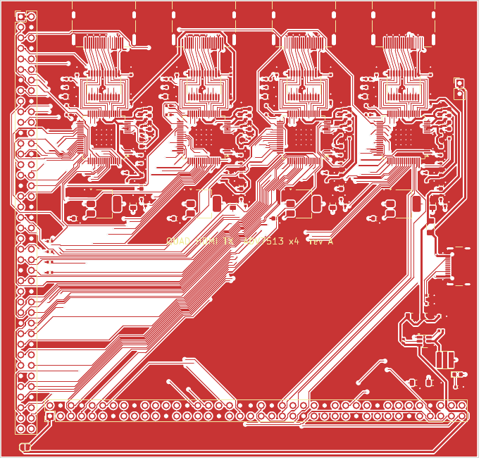
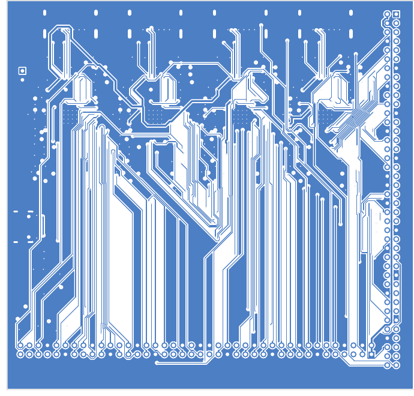
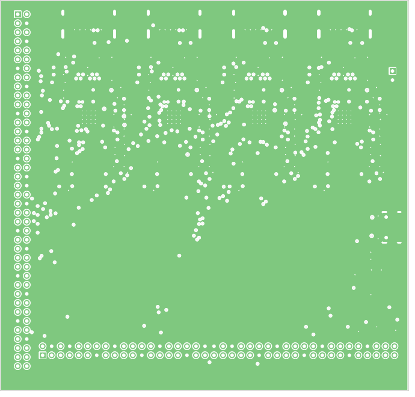
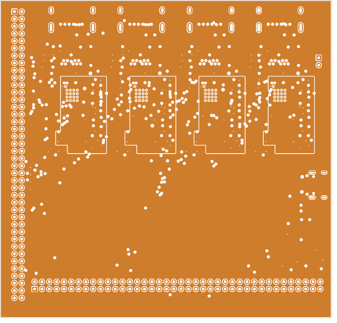
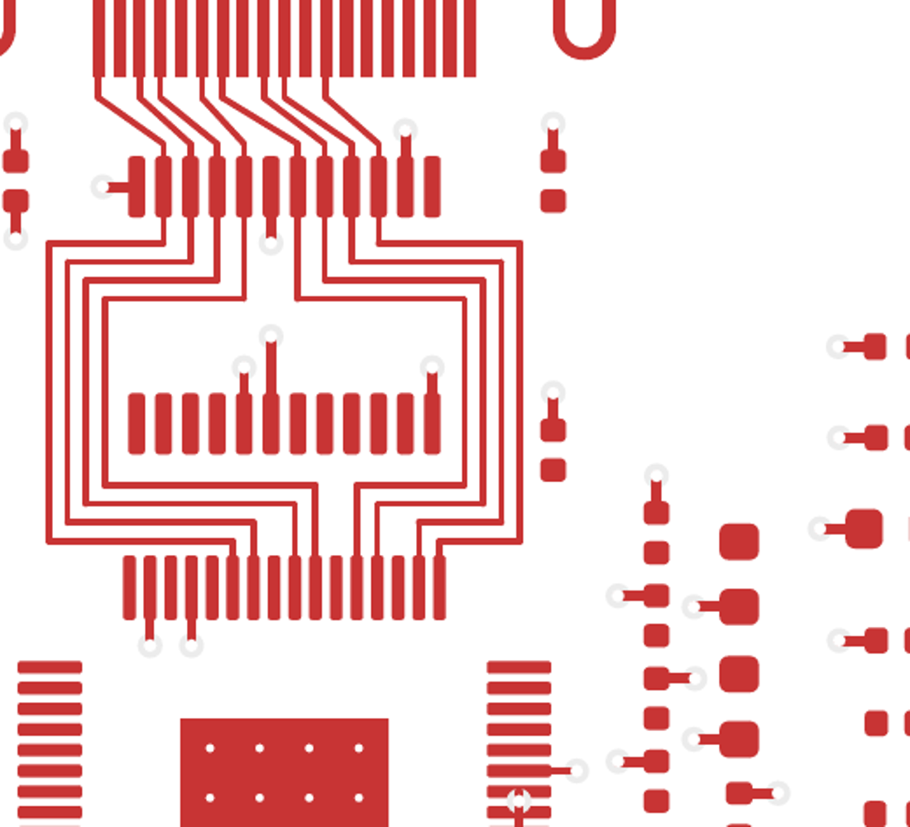

# Quad HDMI TX キャリア基板 (ADV7513 ×4)

FPGA ボードから 24bit RGB ×4 を受け、HDMI 4 本を出す基板の KiCad 7 プロジェクト。
`gen/gen_schematic.py` が回路図・BOM・ピン割り当て表を生成し、`kicad-cli` でネットリストと PDF を書き出している。

| ファイル | 内容 |
|---|---|
| quad_hdmi_tx/quad_hdmi_tx.kicad_pro / *.kicad_sch | KiCad 7 プロジェクト(ルート + 電源 + FPGA コネクタ + HDMI OUT1〜4) |
| quad_hdmi_tx/quad_hdmi_tx.pdf | 回路図 PDF(7 ページ) |
| quad_hdmi_tx/netlist.net | kicad-cli で書き出したネットリスト |
| quad_hdmi_tx/bom.csv, bom_grouped.csv | 部品表(リファレンス別 / 集計、MPN 付き) |
| quad_hdmi_tx/fpga_header_pinmap.csv | J7/J8 のピン → 信号名。FPGA ピン列を埋めて `gen/gen_xdc.py` で XDC を生成 |
| quad_hdmi_tx/quad_hdmi_tx.kicad_pcb | 基板レイアウト(4 層、115 × 110 mm)。`gen/gen_pcb.py` が配置とプレーンを生成し、FreeRouting で自動配線 |
| quad_hdmi_tx/drc.rpt | DRC レポート(pcbnew API) |
| quad_hdmi_tx/fab/ | ガーバー、ドリル、CPL(部品座標)、各層の PDF(`gen/export_fab.sh`) |
| gen/ | 生成スクリプト、ネットリスト検査、配線パイプライン |

## 回路構成

```
USB-C 5V ─ F1(PTC 2A) ─ +5V ─ U5 AP63203 (3.3V 2A buck) ─ +3V3 ─┬─ U13 TLV1117LV18 ─ CH1_1V8 ─ U11 ADV7513 ─ U12 TPD12S016 ─ J1 HDMI
                                                               ├─ U23 ...                          CH2 (I2C bus A, addr 0x7A)
                                                               ├─ U33 ...                          CH3 (I2C bus B, addr 0x72)
                                                               └─ U43 ...                          CH4 (I2C bus B, addr 0x7A)
J7 (2×40): OUT1/OUT2 の RGB24+CLK/DE/HS/VS, I2C_A, HPD, INT      J8 (2×40): OUT3/OUT4, I2C_B
```

### チャネル(×4)

| 要素 | 内容 | 根拠 |
|---|---|---|
| ADV7513BSWZ (LQFP-64 EP) | 24bit RGB 4:4:4 入力 ID 0、セパレートシンク。TMDS 出力 | データシート Rev.B Table 3 のピン配置 |
| R_EXT 887 Ω 1% | TMDS 基準電流 | データシート Table 3 |
| PD/AD 10 kΩ | GND → I2C 0x72(7bit 0x39)、+3V3 → 0x7A(0x3D)。同一バス 2 台をこれで分ける | |
| INT 10 kΩ プルアップ | ヘッダへ | |
| CEC_CLK 0 Ω→GND | CEC 未使用。使う場合は 0 Ω を外して 3〜100 MHz を入れる | Table 3 |
| 未使用オーディオ入力 | SPDIF, MCLK, I2S0-3, SCLK, LRCLK を GND | |
| 電源 | DVDD ×4 / AVDD ×3 / PVDD / BGVDD = 1.8 V、DVDD_3V = 3.3 V。1.8 V はチャネルごとの LDO。AVDD と PVDD/BGVDD はフェライトビーズ経由 | 1.8 V 系は最大 256 mW/個 |
| TPD12S016PWR (TSSOP-24) | TMDS 8 本の ESD、DDC/CEC のレベルシフト(A 側 3.3 V、B 側 5 V プルアップ内蔵)、HPD、5V_OUT(55 mA リミット) | データシート SLLSE96F |
| LS_OE / CT_HPD | +3V3 固定(常時有効) | |
| HDMI A(Molex 208658-1001) | シールド、GND、SH は GND。UTILITY(14) は未接続 | |

### 電源

- USB-C(GCT USB4105-GF-A、USB2.0 16P)、CC1/CC2 に 5.1 kΩ(5 V 3 A シンク宣言)。代替 5 V 入力 J6。
- F1: PTC 2 A。+5V と VBUS に PWR_FLAG。
- U5 AP63203WU(3.3 V 固定、2 A): CIN 10 µF ×2、CBST 0.1 µF、L 4.7 µH(NR4018T4R7M)、COUT 22 µF ×2、EN は 100 kΩ で VIN へ。
- 消費見積: 1.8 V 系 4 × 142 mA ≈ 0.57 A(LDO 損失 ≈ 0.85 W、SOT-223 ×4 に分散)、3.3 V 系合計 ≈ 0.7 A、5 V 入力 ≈ 0.8 A(HDMI 5V_OUT 4 × 55 mA 含む)。
- JP1(ソルダージャンパ)を閉じると J7/J8 の 1-2 ピンから FPGA ボードへ 5 V を供給できる。FPGA ボードが自前電源のときは開けたままにする。

### FPGA コネクタ J7 / J8

- 2×40 ピン 2.54 mm。各チャネルは CLK / DE,HS,VS / D0-3 / ... / D20-23 のグループごとに GND を挟む(信号 28 + GND 8 = 36 ピン/ch)。
- 3.3 V LVCMOS。FPGA ボードの該当バンクは VCCO = 3.3 V であること。
- スタック高さは 30 mm 以下を推奨(148.5 MHz SDR)。FPGA 側で 22〜33 Ω の直列終端を入れられるとなお良い。
- 使用する FPGA ボードのヘッダ ⇔ FPGA ピン対応を `fpga_header_pinmap.csv` の FPGA_pin 列に記入し、`python3 gen/gen_xdc.py quad_hdmi_tx/fpga_header_pinmap.csv > constraints/board.xdc` で XDC を作る。

## 検証状況

| 項目 | 状態 |
|---|---|
| ADV7513 の全 65 ピン、TPD12S016 の全 24 ピンがデータシートどおりに割り当てられている | 済(スクリプトで番号を生成、検査で全ピンの接続を確認) |
| kicad-cli によるネットリスト書き出し | 済(147 部品、233 ネット) |
| ネット検査: データ線 2 ピン、TMDS 3 ピン、HPD/INT 3 ピン、I2C 4 ピン、GND/+3V3 に信号ピンが混ざっていない | 済(`gen/check_netlist.py`) |
| 基板レイアウト(配置・配線) | 済(4 層 115 × 110 mm、配線 3,127 本、ビア 524 個。HDMI・USB-C コネクタは基板端に合わせ済み) |
| DRC(pcbnew API、KiCad 7 の既定ルール + 本基板のルール) | **未接続 0、クリアランス違反 0**。残る 143 件は「フットプリントがライブラリと一致しない」情報のみ |
| TMDS 8 本 × 4 ch | ビアなし、ペア内長差 0.55 mm 以下(スクリプトで固定配線) |
| ガーバー / ドリル / CPL 出力 | 済(`quad_hdmi_tx/fab/`) |
| KiCad GUI での ERC / DRC 再確認 | **未**(GUI で開いて再実行を推奨) |
| 実機評価 | **未** |

### レイアウトの結果

| 層 | 画像 |
|---|---|
| 表面 (F.Cu) |  |
| 裏面 (B.Cu、ミラー表示) |  |
| 内層 1 (GND) |  |
| 内層 2 (+3V3 / CHn_1V8) |  |

TMDS の事前配線(OUT1 周辺、配線前の状態):



自動配線(FreeRouting 1.9、16 パス)後の主なネット長:

| ネット | 長さ | ビア |
|---|---|---|
| +5V | 337 mm | 8 |
| I2C_B_SCL / SDA | 225 / 215 mm | 3 / 3 |
| CH2_INT(最長の制御線) | 184 mm | 3 |
| TMDS(各ペア) | 19.6〜22.5 mm | 0 |

## 発注前チェックリスト

1. **ADV7513 の推奨回路**: ハードウェアユーザーガイド(ADI)で、PVDD/BGVDD のフィルタ構成と HPD/DDC の扱いが本回路(フェライトビーズ + 0.1 µF、TPD12S016 経由)と矛盾しないか確認する。
2. **フットプリント**: ADV7513 の露出パッドは 5.3 mm 角。`LQFP-64-1EP_10x10mm_P0.5mm_EP5x5mm_ThermalVias` を使用(EP のサーマルビアは 0.2 mm ドリル)。
3. **HDMI コネクタ**: Molex 208658-1001 の KiCad 標準フットプリント。別品番なら 1〜19 + シェルの配列を照合する。
4. **USB-C**: GCT USB4105-GF-A の標準フットプリント。NPTH と自身のパッドの間隔が 0.194 mm なので、穴クリアランスの規則を 0.18 mm にしている。
5. **LDO**: TLV1117LV18DCYR(セラミック出力対応、1 A)。AMS1117-1.8 はピン互換だがタンタル出力推奨。
6. **I2C アドレス**: 同一バスに 2 台(0x72 と 0x7A)。HDL の `top.v` はバス 0 = OUT1/OUT2、バス 1 = OUT3/OUT4 でこの割り当てを前提にしている。
7. **KiCad GUI で ERC と DRC を再実行する**: 本リポジトリの検査は pcbnew API のレポート。DRC の残り 143 件は「フットプリントがライブラリと一致しない」情報(ライブラリ名なしで読み込んだため)で、製造には影響しない。
8. **インピーダンス**: TMDS は 0.15 mm 幅 / 0.15 mm 間隔で固定配線している。製造業者の 4 層スタックアップ(例: JLC04161H-7628)の計算値に合わせて幅・間隔を調整し、必要なら `gen/gen_pcb.py` のネットクラスと事前配線幅を変えて再生成する。
9. **自動配線部の目視確認**: RGB バス(148.5 MHz)は FreeRouting の結果をそのまま使っている。J8 → OUT2/OUT4 の長い斜め配線と、ADV 右辺付近の AVDD/PVDD をレビューし、必要なら手で整える。OUT1/OUT3 の AVDD pin15 はスクリプトで L 字に手配線している。
10. **シルク**: 参照記号は F.Fab に置いている(シルクには出ない)。実装は `fab/cpl.csv` の座標で行う。
11. **コネクタの基板端合わせ**: HDMI(Molex 208658)と USB-C(GCT USB4105)のフットプリントには "PCB Edge" の基準線がある。
    生成スクリプトはこの線が基板外形(HDMI: y=0、USB-C: x=115)に一致するよう配置している(HDMI は本体が 1.5 mm、USB-C は 0.5 mm 外形からはみ出す)。
    ケースに入れる場合はこのはみ出し量を前提に開口を設計する。

## 基板レイアウト

### 配置

```
 y=0  ┌───────────────────────────────────────────────────────────┐
      │ J7 │ [J1 HDMI] [J2 HDMI] [J3 HDMI] [J4 HDMI]         H2   │  上辺: HDMI ×4 (開口部は上)
      │ 2× │  U12 TPD   U22 TPD   U32 TPD   U42 TPD                │  TPD12S016 (rot 90、TMDS パッドをコネクタ側に)
      │ 40 │  U11 ADV   U21 ADV   U31 ADV   U41 ADV    J6  [J5]    │  ADV7513 (rot 180、TMDS を上辺、データを下辺/左辺に)
      │    │  U13 LDO   U23 LDO   U33 LDO   U43 LDO      USB-C     │  チャネルごとの 1.8 V LDO
      │    │          (配線チャネル: ヘッダ → ADV)      U5 buck    │
      │    │  R1-4                                        L1 C5x   │
      │    └─────── J8 2×40 (OUT2/OUT4) ───────────────  D1        │  下辺: J8
 y=110└───────────────────────────────────────────────────────────┘
        x=0                                                   x=115
```

- TMDS の並び順が ADV7513(rot 180)→ TPD12S016(rot 90)→ HDMI(rot 90)で **交差なし**に揃うよう向きを決めている
  (ADV 上辺: TX2+ TX2- TX1+ TX1- TX0+ TX0- TXC+ TXC-、TPD 上辺: D2+ D2- D1+ D1- D0+ D0- CLK+ CLK-、コネクタ: 1 3 4 6 7 9 10 12)。
- J7(左辺)は OUT1/OUT3、J8(下辺)は OUT2/OUT4 を受け持つ。ヘッダ内で GND を各信号グループの間に挟んでいる。
- 電源部は右辺(USB-C の開口部は右)。

### 層構成(4 層、1.6 mm)

| 層 | 用途 |
|---|---|
| F.Cu | 信号(TMDS、RGB バス)、部品 |
| In1.Cu (GND) | GND プレーン(全面) |
| In2.Cu (PWR) | +3V3 プレーン。各 ADV の周囲は CHn_1V8 の島(優先度 1) |
| B.Cu | 信号、配線後に GND ベタ |

### ルール

| 項目 | 値 |
|---|---|
| クリアランス | 0.15 mm(Power クラス 0.2) |
| 配線幅 | 0.2 mm(TMDS 0.15、Power 0.5) |
| ビア | 0.6/0.3 mm(TMDS 0.5/0.3、Power 0.8/0.4) |
| 差動 | 100 Ω 目標、0.15/0.15 mm(**製造業者のインピーダンス計算で要調整**) |

### 生成と配線のパイプライン

```
cd hardware/gen
python3 gen_pcb.py                       # 配置・外形・プレーン・ネットクラス -> quad_hdmi_tx.kicad_pcb
python3 route_pcb.py export              # quad_hdmi_tx.dsn
xvfb-run -a java -jar freerouting-1.9.0.jar -de ../quad_hdmi_tx/quad_hdmi_tx.dsn -do ../quad_hdmi_tx/quad_hdmi_tx.ses -mp 80
python3 route_pcb.py import              # SES 取り込み、外層 GND ベタ、ゾーン塗り、DRC -> drc.rpt
python3 layout_report.py                 # 配線長、ビア数、TMDS ペア長差、DRC 集計
./export_fab.sh                          # fab/ にガーバー・ドリル・CPL・PDF
python3 render_images.py                 # fab/*.pdf → docs/images/pcb-*.png (Pillow, pdftoppm)
```

FreeRouting を使う上での注意(実測で判明したもの):

- 外層のベタを DSN に含めると障害物として扱われ配線できないため、ベタは SES 取り込み後に追加している。
- FreeRouting 2.1 は SMD パッドから内層プレーンへのビアを自分では作らない。`gen_pcb.py` が GND / +3V3 / CHn_1V8 の全 SMD パッドに
  ファンアウトビア(ロック済み)を先に置き、DSN には固定配線として渡している。
- 2.1 はコマンドラインの `-mp` / `-mt` を無視し、設定ファイル(`/tmp/freerouting/freerouting.json` など)の
  `router.max_passes`(既定 9999)と `router.max_threads`(既定 1)を使う。ヘッドレスでは `gui.enabled` を false にする。
- 1.9.0 は `-mp` を受け付けるが GUI 必須(Xvfb で起動できる)。

## レイアウト指針

- TMDS: 100 Ω 差動、ペア内長差 0.1 mm 以内、ペア間はゆるく揃える。ADV7513 → TPD12S016 → コネクタを一直線に、TPD はコネクタから 10 mm 以内。
- RGB バス(148.5 MHz SDR): ヘッダ → ADV7513 を短く、GND プレーンを連続させる。CLK はデータより長めにしない。
- 1.8 V: LDO ごとに ADV7513 の近くに配置。0.1 µF は各電源ピン直近。
- 4 層(信号 / GND / 電源 / 信号)を推奨。2 層でも可能だが TMDS のインピーダンス管理が難しい。
- 発熱: LDO ×4(各 ≈ 0.2 W)と ADV7513 ×4 に銅箔面積を確保する。

## 発注手順(例: JLCPCB)

1. KiCad で `quad_hdmi_tx.kicad_pro` を開き、ERC → 「PCB を更新」でフットプリントを配置、レイアウトする。
2. 基板外形、4 層、1.6 mm、ENIG(0.5 mm ピッチの LQFP と TSSOP に無難)。
3. ガーバー + ドリルを出力、`bom_grouped.csv` と CPL(配置座標)を出して実装を依頼する。MPN は Murata / Yageo / Taiyo Yuden / Diodes / TI / ADI / Molex / GCT の標準品。
4. ADV7513、TPD12S016、AP63203、TLV1117LV は実装業者の在庫にない場合があるので、事前に入手性を確認する。

## 回路図の再生成

```
cd hardware/gen
python3 gen_schematic.py                 # *.kicad_sch, bom.csv, fpga_header_pinmap.csv
cd ../quad_hdmi_tx
kicad-cli sch export netlist --format kicadsexpr -o netlist.net quad_hdmi_tx.kicad_sch
python3 ../gen/check_netlist.py netlist.net
kicad-cli sch export pdf -o quad_hdmi_tx.pdf quad_hdmi_tx.kicad_sch
```
