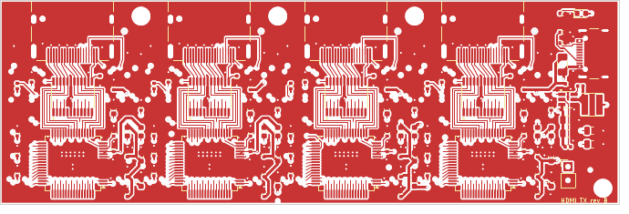
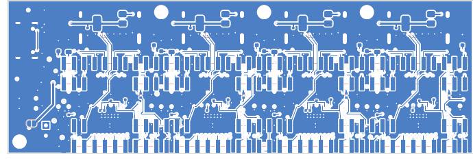
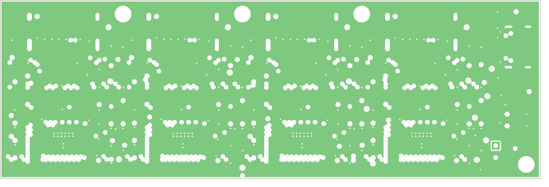
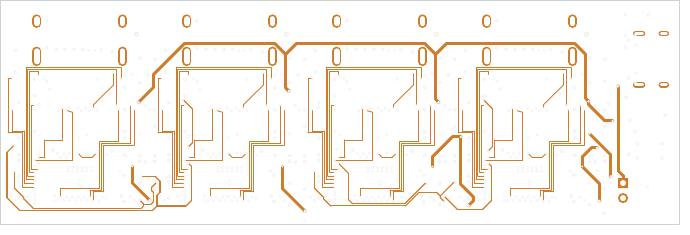
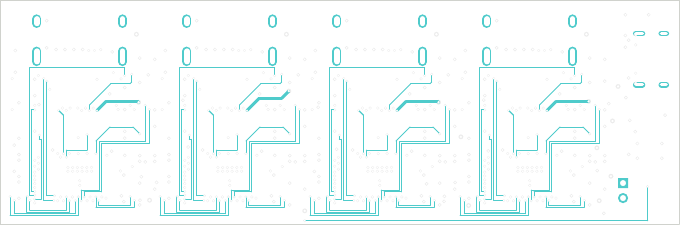
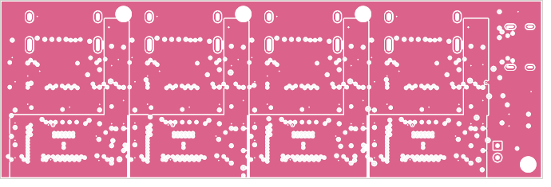
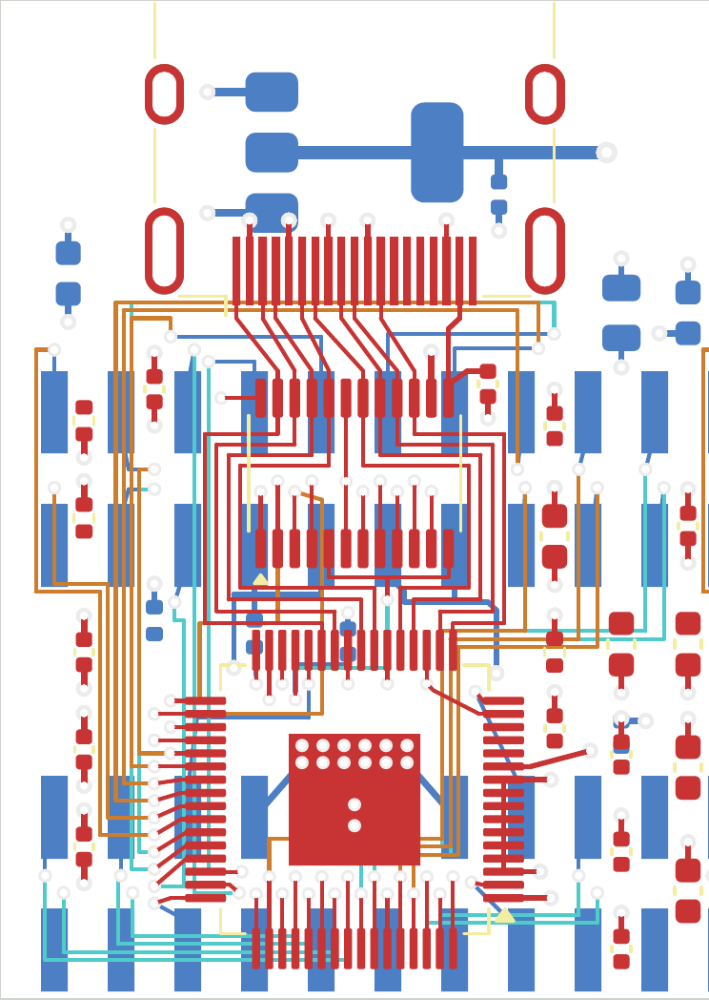
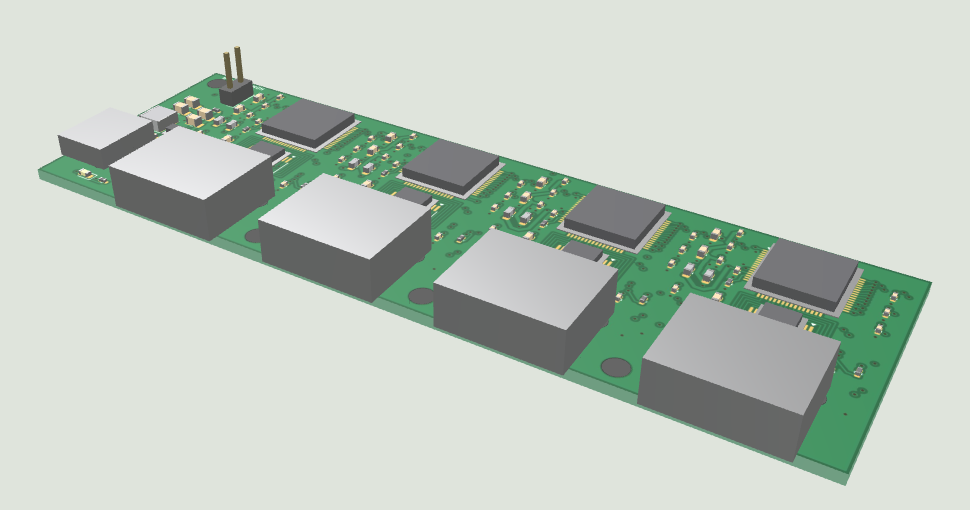
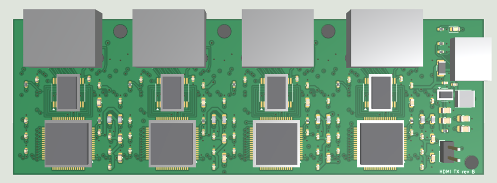
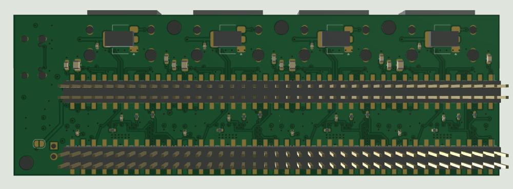

# Quad HDMI TX キャリア基板 (ADV7513 ×4)

FPGA ボードから 24bit RGB ×4 を受け、HDMI 4 本を出す基板の KiCad 7 プロジェクト。
`gen/gen_schematic.py` が回路図・BOM・ピン割り当て表を生成し、`kicad-cli` でネットリストと PDF を書き出している。

| ファイル | 内容 |
|---|---|
| quad_hdmi_tx/quad_hdmi_tx.kicad_pro / *.kicad_sch | KiCad 7 プロジェクト(ルート + 電源 + FPGA コネクタ + HDMI OUT1〜4) |
| quad_hdmi_tx/quad_hdmi_tx.pdf | 回路図 PDF(7 ページ) |
| quad_hdmi_tx/netlist.net | kicad-cli で書き出したネットリスト |
| quad_hdmi_tx/bom.csv, bom_grouped.csv | 部品表(リファレンス別 / 集計、MPN 付き) |
| quad_hdmi_tx/fpga_header_pinmap.csv | J7/J8 のピン → 信号名。FPGA ピン列を埋めて `gen/gen_xdc.py` で XDC を生成 |
| quad_hdmi_tx/quad_hdmi_tx.kicad_pcb | 基板レイアウト rev B(6 層、115 × 38 mm の細長い基板)。`gen/gen_pcb.py` が配置・プレーン・事前配線を生成し、FreeRouting で自動配線 |
| quad_hdmi_tx/drc.rpt | DRC レポート(pcbnew API) |
| quad_hdmi_tx/fab/ | ガーバー、ドリル、CPL(部品座標)、各層の PDF(`gen/export_fab.sh`) |
| quad_hdmi_tx/3d/ | STEP(基板のみ)、簡易 3D モデル(OBJ + テクスチャ)、three.js ビューア(`gen/gen_3d.py`、`gen/make_3d_textures.py`) |
| gen/ | 生成スクリプト、ネットリスト検査、配線パイプライン |

## 回路構成

```
USB-C 5V ─ F1(PTC 2A) ─ +5V ─ U5 AP63203 (3.3V 2A buck) ─ +3V3 ─┬─ U13 TLV1117LV18 ─ CH1_1V8 ─ U11 ADV7513 ─ U12 TPD12S016 ─ J1 HDMI
                                                               ├─ U23 ...                          CH2 (I2C bus A, addr 0x7A)
                                                               ├─ U33 ...                          CH3 (I2C bus B, addr 0x72)
                                                               └─ U43 ...                          CH4 (I2C bus B, addr 0x7A)
J7 / J8 (2×40 SMD、裏面): 各チャネル 20 ピンずつ。J7 = D13-23 + D1/D2/D4/D5/D10、J8 = D0/D3/D6-9/D11/D12, CLK, DE/HS/VS, HPD, INT (+ I2C_A/I2C_B, FPGA_5V)
```

### チャネル(×4)

| 要素 | 内容 | 根拠 |
|---|---|---|
| ADV7513BSWZ (LQFP-64 EP) | 24bit RGB 4:4:4 入力 ID 0、セパレートシンク。TMDS 出力 | データシート Rev.B Table 3 のピン配置 |
| R_EXT 887 Ω 1% | TMDS 基準電流 | データシート Table 3 |
| PD/AD 10 kΩ | GND → I2C 0x72(7bit 0x39)、+3V3 → 0x7A(0x3D)。同一バス 2 台をこれで分ける | |
| INT 10 kΩ プルアップ | ヘッダへ | |
| CEC_CLK 0 Ω→GND | CEC 未使用。使う場合は 0 Ω を外して 3〜100 MHz を入れる | Table 3 |
| 未使用オーディオ入力 | SPDIF, MCLK, I2S0-3, SCLK, LRCLK を GND | |
| 電源 | DVDD ×4 / AVDD ×3 / PVDD / BGVDD = 1.8 V、DVDD_3V = 3.3 V。1.8 V はチャネルごとの LDO。AVDD と PVDD/BGVDD はフェライトビーズ経由 | 1.8 V 系は最大 256 mW/個 |
| TPD12S016PWR (TSSOP-24) | TMDS 8 本の ESD、DDC/CEC のレベルシフト(A 側 3.3 V、B 側 5 V プルアップ内蔵)、HPD、5V_OUT(55 mA リミット) | データシート SLLSE96F |
| LS_OE / CT_HPD | +3V3 固定(常時有効) | |
| HDMI A(Molex 208658-1001) | シールド、GND、SH は GND。UTILITY(14) は未接続 | |

### 電源

- USB-C(GCT USB4105-GF-A、USB2.0 16P)、CC1/CC2 に 5.1 kΩ(5 V 3 A シンク宣言)。代替 5 V 入力 J6。
- F1: PTC 2 A。+5V と VBUS に PWR_FLAG。
- U5 AP63203WU(3.3 V 固定、2 A): CIN 10 µF ×2、CBST 0.1 µF、L 4.7 µH(NR4018T4R7M)、COUT 22 µF ×2、EN は 100 kΩ で VIN へ。
- 消費見積: 1.8 V 系 4 × 142 mA ≈ 0.57 A(LDO 損失 ≈ 0.85 W、SOT-223 ×4 に分散)、3.3 V 系合計 ≈ 0.7 A、5 V 入力 ≈ 0.8 A(HDMI 5V_OUT 4 × 55 mA 含む)。
- JP1(ソルダージャンパ)を閉じると J8 の 39-40 ピン(FPGA_5V)から FPGA ボードへ 5 V を供給できる。FPGA ボードが自前電源のときは開けたままにする。

### FPGA コネクタ J7 / J8

- 2×40 ピン 2.54 mm の SMD ヘッダ 2 本を **裏面** に長辺と平行に置く(Samtec TSM-140-01-L-DV 相当)。リボンケーブル(IDC)で FPGA ボードへ。
- ヘッダの列 k(ピン 2k-1 / 2k)は OUT ⌈k/10⌉ の ADV7513 の真下にある。各チャネルは J7 で 20 ピン(ADV 左辺の D13-23 と下辺の D1/D2/D4/D5/D10、GND ×4)、J8 で 20 ピン(ADV 下辺の D0/D3/D6-9/D11、CLK, DE/HS と D12、VS, HPD, INT、GND ×4、OUT1/OUT3 は I2C、OUT2 は FPGA_5V ×2)。
  データ線の並びは配線経路(内層の通路の順序)で決めたもので、ビット順ではない。FPGA 側のピン割り当ては `fpga_header_pinmap.csv` を参照。
- GND は ADV / TPD の真下の列(J7 列 4-7 下段、J8 列 4-7 上段)に置いている(表面がふさがっていて信号のビアが打てない位置)。リボンケーブル上では 4〜9 本おき。ケーブルは 15 cm 以下を推奨(148.5 MHz SDR)。
- 3.3 V LVCMOS。FPGA ボードの該当バンクは VCCO = 3.3 V であること。
- スタック高さは 30 mm 以下を推奨(148.5 MHz SDR)。FPGA 側で 22〜33 Ω の直列終端を入れられるとなお良い。
- 使用する FPGA ボードのヘッダ ⇔ FPGA ピン対応を `fpga_header_pinmap.csv` の FPGA_pin 列に記入し、`python3 gen/gen_xdc.py quad_hdmi_tx/fpga_header_pinmap.csv > constraints/board.xdc` で XDC を作る。

## 検証状況

| 項目 | 状態 |
|---|---|
| ADV7513 の全 65 ピン、TPD12S016 の全 24 ピンがデータシートどおりに割り当てられている | 済(スクリプトで番号を生成、検査で全ピンの接続を確認) |
| kicad-cli によるネットリスト書き出し | 済(147 部品、233 ネット) |
| ネット検査: データ線 2 ピン、TMDS 3 ピン、HPD/INT 3 ピン、I2C 4 ピン、GND/+3V3 に信号ピンが混ざっていない | 済(`gen/check_netlist.py`) |
| 基板レイアウト(配置・配線) | 済(rev B: 6 層 115 × 38 mm、配線 2010 本、ビア 634 個。HDMI・USB-C コネクタは基板端に合わせ済み) |
| DRC(pcbnew API、KiCad 7 の既定ルール + 本基板のルール) | 未接続 0、クリアランス / 穴 / 外形 / コートヤード違反 0(残りは `lib_footprint_issues` 147 件 = 生成したフットプリントがライブラリと一致しないという情報のみ) |
| TMDS 8 本 × 4 ch | ビアなし、ペア内長差 0.47 mm 以下(スクリプトで固定配線) |
| ガーバー / ドリル / CPL 出力 | 済(`quad_hdmi_tx/fab/`) |
| KiCad GUI での ERC / DRC 再確認 | **未**(GUI で開いて再実行を推奨) |
| 実機評価 | **未** |

### レイアウトの結果

| 層 | 画像 |
|---|---|
| 表面 (F.Cu) |  |
| 裏面 (B.Cu、ミラー表示) |  |
| 内層 1 (GND) |  |
| 内層 2 (SIG1) |  |
| 内層 3 (SIG2) |  |
| 内層 4 (+3V3 / CHn_1V8) |  |

TMDS の事前配線(OUT1 周辺、配線前の状態):



自動配線(FreeRouting 1.9)後の主なネット長:

```
RGB バス / 同期 (112 本): 最長 51.3 mm (D16、ヘッダ上の横レーン経由)、平均 21.4 mm、最短 4.2 mm。すべて gen_pcb.py の固定配線 (ビア 1〜2 個)
I2C_A_SCL 70 mm (OUT1/OUT2 の ADV とプルアップ、J8 経由)、I2C_B_SCL 56 mm
HPD 20 mm、INT 25 mm、DDC_SCL / CEC 15 mm (TPD -> HDMI)、FPGA_5V 72 mm (J8 ピン 39/40 -> JP1)
+5V 197 mm (ビア 9)、+3V3 132 mm (ビア 41、内層 4 のプレーンが主)、GND 326 mm (ビア 203、内層 1 のプレーンが主)
TMDS: ペア内長差 0.05〜0.47 mm、ビアなし
```

### 3D モデル



| 表 | 裏 |
|---|---|
|  |  |

`quad_hdmi_tx/3d/` に 3 種類ある(`gen/gen_3d.py` と `gen/make_3d_textures.py` で生成):

| ファイル | 内容 |
|---|---|
| `quad_hdmi_tx.step` | kicad-cli の STEP 出力。この環境には KiCad の 3D モデルライブラリが無いため **基板のみ**(部品なし)。筐体設計の基準に使える |
| `quad_hdmi_tx_simplified.obj` / `.mtl` / `tex_top.png` / `tex_bot.png` | 簡易モデル(Wavefront OBJ、mm、Y 上)。基板は表裏にレジスト・金パッド・シルクのテクスチャ、部品はパッケージ種別の寸法表による直方体(IC・受動部品・コネクタ・ヘッダのピン) |
| `viewer.html` | 上の簡易モデルを three.js で回転表示する 1 ファイルのビューア(ブラウザで開く) |

部品の外形は寸法表の近似なので、正確な 3D モデルが要るときは KiCad の 3D ライブラリを入れて `kicad-cli pcb export step` を再実行する。

## 発注前チェックリスト

1. **ADV7513 の推奨回路**: ハードウェアユーザーガイド(ADI)で、PVDD/BGVDD のフィルタ構成と HPD/DDC の扱いが本回路(フェライトビーズ + 0.1 µF、TPD12S016 経由)と矛盾しないか確認する。
2. **フットプリント**: ADV7513 の露出パッドは 5.3 mm 角。`LQFP-64-1EP_10x10mm_P0.5mm_EP5x5mm` を使い、EP のサーマルビア(0.5/0.3 mm ×14)は裏面ヘッダのパッドを避けて `gen_pcb.py` が打っている。
3. **HDMI コネクタ**: Molex 208658-1001 の KiCad 標準フットプリント。別品番なら 1〜19 + シェルの配列を照合する。
4. **USB-C**: GCT USB4105-GF-A の標準フットプリント。NPTH と自身のパッドの間隔が 0.194 mm なので、穴クリアランスの規則を 0.18 mm にしている。
5. **LDO**: TLV1117LV18DCYR(セラミック出力対応、1 A)。AMS1117-1.8 はピン互換だがタンタル出力推奨。
6. **I2C アドレス**: 同一バスに 2 台(0x72 と 0x7A)。HDL の `top.v` はバス 0 = OUT1/OUT2、バス 1 = OUT3/OUT4 でこの割り当てを前提にしている。
7. **KiCad GUI で ERC と DRC を再実行する**: 本リポジトリの検査は pcbnew API のレポート。DRC の残り 143 件は「フットプリントがライブラリと一致しない」情報(ライブラリ名なしで読み込んだため)で、製造には影響しない。
8. **インピーダンス**: TMDS は 0.15 mm 幅 / 0.15 mm 間隔で固定配線している。製造業者の 6 層スタックアップ(例: JLC06161H-3313、F.Cu〜In1 が 0.1 mm 程度)の計算値に合わせて幅・間隔を調整し、必要なら `gen/gen_pcb.py` のネットクラスと事前配線幅を変えて再生成する。
9. **自動配線部の目視確認**: RGB バス(148.5 MHz)30 本は `gen_pcb.py` の固定配線(内層 SIG1/SIG2、各線 40 mm 以下)。電源・I2C・CEC・HPD 系は FreeRouting の結果なので、ADV 右辺付近の AVDD/PVDD と I2C の引き回しをレビューし、必要なら手で整える。
10. **シルク**: 参照記号は F.Fab に置いている(シルクには出ない)。実装は `fab/cpl.csv` の座標で行う。
11. **コネクタの基板端合わせ**: HDMI(Molex 208658)と USB-C(GCT USB4105)のフットプリントには "PCB Edge" の基準線がある。
    生成スクリプトはこの線が基板外形(HDMI: y=0、USB-C: x=115)に一致するよう配置している(HDMI は本体が 1.5 mm、USB-C は 0.5 mm 外形からはみ出す)。
    ケースに入れる場合はこのはみ出し量を前提に開口を設計する。
12. **裏面のヘッダと IDC ソケット**: J7/J8 の中心間隔は 15.4 mm、J8 は下辺から 4.4 mm。IDC ソケット(幅 8.9 mm)は J8 側が基板端とほぼ面一になる。基板の下に高さ 10 mm 以上の空間が必要。
13. **両面実装**: LDO ×4、そのコンデンサ、ヘッダ 2 本、JP1 が裏面。実装業者には両面(F+B)の CPL を渡す。裏面の SMD ヘッダはリフロー可能品(TSM-140-01-L-DV 等)を選ぶ。
14. **取付穴**: M3 ×4(HDMI の間に 3 個、右下に 1 個)。HDMI の間の穴はプラグのオーバーモールド(幅 ~21 mm)と干渉しない位置だが、ナットは基板の裏側に置くこと。

## 基板レイアウト

### 配置(rev B: 115 × 38 mm、縦横比 0.33)

```
 y=0  ┌───────────────────────────────────────────────────────────────────────┐
      │ [J1 HDMI] H1 [J2 HDMI]  H2 [J3 HDMI]  H4 [J4 HDMI]   R5 R6 F1  [J5]   │  上辺: HDMI ×4 (25.4 mm ピッチ、開口部は上)。裏面の真裏に LDO
      │  U12 TPD     U22 TPD       U32 TPD       U42 TPD      C54     USB-C   │  TPD12S016 (rot 90)。両脇に +3V3 / 5V 系のコンデンサ
      │  U11 ADV     U21 ADV       U31 ADV       U41 ADV      U5  C51  L1     │  ADV7513 (rot 180)。左右の列に 1V8 / AVDD / PVDD 系
      │                                                      C52 C53  C55 C56 │  電源部 (右端)
 y=38 └───────────────────────────────────────────────────────────────────────┘
        x=0                              裏面: J7 (y=18.2) と J8 (y=33.6) が x=1.6..101.6 に横たわる        x=115

 裏面 (透視): [LDO U13][LDO U23][LDO U33][LDO U43] ← HDMI のシェルタブの穴の間
             ═══════════ J7 2×40 (列 1-10 = OUT1, 11-20 = OUT2, 21-30 = OUT3, 31-40 = OUT4) ═══════════
             ═══════════ J8 2×40 (同じ列割り) ═══════════════════════════════════════════════════  JP1
```

- HDMI 4 個の横幅(4 × 25.4 mm)に電源部を足した 115 mm を横幅とし、縦幅は 38 mm(横の 1/3 以下)。
- 各チャネルは幅 25.4 mm = ヘッダ 10 列。ヘッダの列は ADV の真下なので、RGB バスの配線は 1 本あたり 15 mm 以下。
- TMDS の並び順が ADV7513(rot 180)→ TPD12S016(rot 90)→ HDMI(rot 90)で **交差なし**に揃うよう向きを決めている
  (ADV 上辺: TX2+ TX2- TX1+ TX1- TX0+ TX0- TXC+ TXC-、TPD 上辺: D2+ D2- D1+ D1- D0+ D0- CLK+ CLK-、コネクタ: 1 3 4 6 7 9 10 12)。
- 裏面ヘッダのパッド(1.0 mm 幅、2.54 mm ピッチ)の隙間は 1.54 mm しかないので、貫通ビアはパッド列の隙間の中心(x = cx ± 2.54 m)か、
  2 列の間 / J7-J8 の間の帯に置く。2 端子部品はすべて縦置きでこの x に載せ、外向きのビアが隙間に来るようにしている。
  TPD の A 側ピンのビア(y = 18.3 / 18.7)は J7 の 2 列の隙間(y 17.25〜19.15)に、ADV 上辺の囲われたピンのビア(y = 26.0 / 26.6)は J7-J8 の間の帯に入る。
- ADV のデータピンはルータ任せでは半分が配線できない(裏面ヘッダのパッドが B.Cu を塞ぐ)ので、`gen_pcb.py` が 30 本の RGB/同期/制御線をすべて事前配線する(残りの電源・I2C・CEC などが FreeRouting):
  - 下辺 16 ピンのエスケープビアは本体下(EP とパッド内端の間 = J8 の 2 列の隙間に当たる y)に 2 段。真下の J8 下段 4 本(D11/D8/D3/HS)は裏面で直落とし、
    D6/D7/CLK/D9 と DE/D0 は SIG2 の横レーン(y = 34.8〜36.5)で J8 列 1-2 / 列 9 の隙間ビアへ、D1/D2/D4/D5/D10 は ADV 右脇の通路(x = cx+3.35/3.65/3.95)を上って J7 列 8-10 へ。
  - 左辺 16 ピンは左へ(上 5 本は x=cx-7.0/-7.62 に交互、中 8 本は隙間の列 x=cx-7.62 に 0.65 ピッチで斜めに、D14/D13 は本体下、D12 は隙間の列の一番下)。
    D16-D23 と DDC は左の内層通路(x = cx-8.19〜-9.69、SIG1/SIG2 各 6 レーン)を上り、J7 列 1-2 の隙間ビア、またはヘッダの上(y = 11.5〜12.1)の横レーン経由で列 5-8 上段へ。
    D13/D14/D15 は ADV 脇の帯(x = cx-6.5〜-5.5)を SIG2 で上って列 3-4 へ。J8 列 4-7 上段(GND)は EP のサーマルビアに裏面で直結。
  - レーンの割り当ては「右の通路ほど低い横レーン」「横レーンから下に曲がる先は左ほど低いレーン」の規則で決め、事前配線どうしが交差しないようにしている。
  - そのほか、ルータが落としやすい DDC_SCL(TPD → HDMI、SIG2 で右上へ抜けて表面でコネクタの上を回る)と FPGA_5V(J8 ピン 39/40 → JP1、SIG2 で基板下端を右へ)も固定配線。
- LDO(SOT-223)は HDMI コネクタの真裏、シェルタブの穴の間。出力は裏面の太い配線で内層 4 の 1V8 の島の「首」へ入る。
- 電源部は右端(USB-C の開口部は右)。

### 層構成(6 層、1.6 mm)

| 層 | 用途 |
|---|---|
| F.Cu | 信号(TMDS 事前配線、短い引き出し)、部品 |
| In1.Cu (GND) | GND プレーン(全面) |
| In2.Cu (SIG1) / In3.Cu (SIG2) | 信号(RGB バス、制御線、+5V) |
| In4.Cu (PWR) | +3V3 プレーン。各 ADV の周囲は CHn_1V8 の島(優先度 1)。島は LDO へ向けて首を伸ばしている |
| B.Cu | FPGA ヘッダ、LDO、信号、配線後に GND ベタ |

4 層では裏面ヘッダのパッド列が B.Cu を塞ぐため、RGB バスの配線が成立しない。6 層にして内層 2 層を信号に使う。

### ルール

| 項目 | 値 |
|---|---|
| クリアランス | 0.15 mm |
| 配線幅 | 0.2 mm(TMDS 0.15、Power 0.5) |
| ビア | 0.6/0.3 mm(TMDS・アクセスビア 0.5/0.3、Power 0.8/0.4) |
| 差動 | 100 Ω 目標、0.15/0.15 mm(**製造業者のインピーダンス計算で要調整**) |

### 生成と配線のパイプライン

```
cd hardware/gen
python3 gen_pcb.py                       # 配置・外形・プレーン・事前配線・ファンアウト -> quad_hdmi_tx.kicad_pcb, drc_pre.rpt
python3 route_pcb.py export              # quad_hdmi_tx.dsn
xvfb-run -a java -jar freerouting-1.9.0.jar -de ../quad_hdmi_tx/quad_hdmi_tx.dsn -do ../quad_hdmi_tx/quad_hdmi_tx.ses -mp 24 -oit 1.0   # 約 10 分
python3 route_pcb.py import              # SES 取り込み、外層 GND ベタ、ゾーン塗り、DRC -> drc.rpt
python3 layout_report.py                 # 配線長、ビア数、TMDS ペア長差、DRC 集計
./export_fab.sh                          # fab/ にガーバー・ドリル・CPL・PDF
python3 render_images.py                 # fab/*.pdf → docs/images/pcb-*.png (Pillow, pdftoppm)
python3 gen_3d.py                        # 3d/board3d.json, 簡易 OBJ/MTL (pcbnew)
python make_3d_textures.py               # 3d/tex_*.png と 3d/viewer.html (Pillow + numpy。先に各層の白黒 PDF→PNG が要る、スクリプト冒頭参照)
```

FreeRouting を使う上での注意(実測で判明したもの):

- 外層のベタを DSN に含めると障害物として扱われ配線できないため、ベタは SES 取り込み後に追加している。
- FreeRouting 2.1 は SMD パッドから内層プレーンへのビアを自分では作らない。`gen_pcb.py` が GND / +3V3 / CHn_1V8 の全 SMD パッドに
  ファンアウトビア(ロック済み)を先に置き、DSN には固定配線として渡している。
- 2.1 はコマンドラインの `-mp` / `-mt` を無視し、設定ファイル(`/tmp/freerouting/freerouting.json` など)の
  `router.max_passes`(既定 9999)と `router.max_threads`(既定 1)を使う。ヘッドレスでは `gui.enabled` を false にする。
- 1.9.0 は `-mp` を受け付けるが GUI 必須(Xvfb で起動できる)。

## レイアウト指針

- TMDS: 100 Ω 差動、ペア内長差 0.1 mm 以内、ペア間はゆるく揃える。ADV7513 → TPD12S016 → コネクタを一直線に、TPD はコネクタから 10 mm 以内。
- RGB バス(148.5 MHz SDR): ヘッダ → ADV7513 を短く、GND プレーンを連続させる。CLK はデータより長めにしない。
- 1.8 V: LDO ごとに ADV7513 の近くに配置。0.1 µF は各電源ピン直近。
- 4 層(信号 / GND / 電源 / 信号)を推奨。2 層でも可能だが TMDS のインピーダンス管理が難しい。
- 発熱: LDO ×4(各 ≈ 0.2 W)と ADV7513 ×4 に銅箔面積を確保する。

## 発注手順(例: JLCPCB)

1. KiCad で `quad_hdmi_tx.kicad_pro` を開き、ERC → 「PCB を更新」でフットプリントを配置、レイアウトする。
2. 基板外形、4 層、1.6 mm、ENIG(0.5 mm ピッチの LQFP と TSSOP に無難)。
3. ガーバー + ドリルを出力、`bom_grouped.csv` と CPL(配置座標)を出して実装を依頼する。MPN は Murata / Yageo / Taiyo Yuden / Diodes / TI / ADI / Molex / GCT の標準品。
4. ADV7513、TPD12S016、AP63203、TLV1117LV は実装業者の在庫にない場合があるので、事前に入手性を確認する。

## 回路図の再生成

```
cd hardware/gen
python3 gen_schematic.py                 # *.kicad_sch, bom.csv, fpga_header_pinmap.csv
cd ../quad_hdmi_tx
kicad-cli sch export netlist --format kicadsexpr -o netlist.net quad_hdmi_tx.kicad_sch
python3 ../gen/check_netlist.py netlist.net
kicad-cli sch export pdf -o quad_hdmi_tx.pdf quad_hdmi_tx.kicad_sch
```
